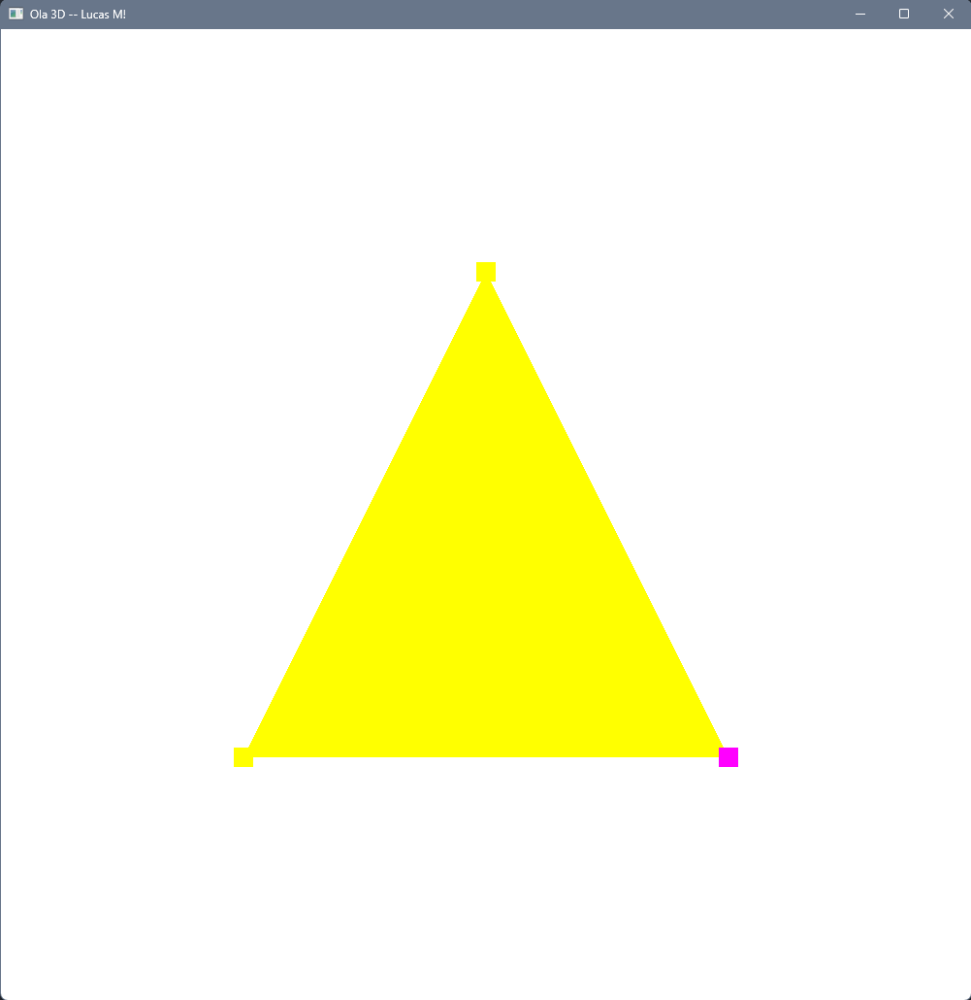

# Atividade M1 - Computação Gráfica

## Resultado

Abaixo está uma visualização do programa em execução:



## Como Executar

1. Compile o projeto usando CMake:

```bash
mkdir build
cd build
cmake ..
cmake --build .
```

2. Execute o programa gerado:

```bash
./Hello3D
```
